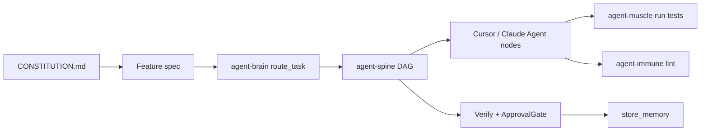

# Product layer — constitution → feature spec → organs

Ship features by writing **what must be true**, not by micromanaging every edit. Coding agents (Cursor, Claude, Codex) remain the implementers; organs **route, orchestrate, execute, and verify**.

## Artifacts

| File | Purpose |
|------|---------|
| `CONSTITUTION.md` | Project invariants — stack, quality bar, architecture, non-goals |
| `docs/features/<name>.md` | One detailed feature spec per capability |
| `.cursor/rules/product-layer.mdc` | Hooks agents to read constitution + active spec each turn |

## Quick start

```bash
# 1. Scaffold in your app repo
agent-brain/scripts/product-init.sh --dir /path/to/your-app

# 2. Edit CONSTITUTION.md and docs/features/my-feature.md

# 3. Enable product skill pack (optional)
agent-brain add @product-layer

# 4. Run the spine workflow (LocalAgent stub today; Cursor implements Agent nodes)
agent-spine init --with feature-from-spec
agent-spine run ~/.config/agent-spine/workflows/feature-from-spec.yaml \
  --payload '{
    "repo_root": ".",
    "constitution": "CONSTITUTION.md",
    "feature_spec": "docs/features/my-feature.md"
  }'
```

## Flow



### Node responsibilities

1. **LoadSpec** — Read constitution + spec; extract acceptance criteria, constraints, interfaces.
2. **SpecGate** — Block if spec lacks acceptance criteria or test plan.
3. **Hydrate → Plan → Write** — Standard universal-developer loop, scoped to the spec.
4. **TestLint → QualityGate** — Tests and linters must pass; loop back to Write on failure.
5. **ReviewGate** — Human sign-off before merge (disable LocalAgent auto-approve in prod).
6. **Summary** — `store_memory` durable decisions; optional PR body.

## Writing a good feature spec

Use `FEATURE-SPEC.template.md`. Every spec must include:

- **Capability** — one paragraph, user-visible outcome
- **Acceptance criteria** — testable checklist
- **Constraints** — from constitution + feature-specific rules
- **Interfaces** — routes, types, CLI, events
- **Test plan** — unit, integration, manual
- **Non-goals** — explicit scope cuts

## Cursor / Claude integration

Agent nodes do not call LLMs directly today. **You** (or a connected harness) implement Agent node work:

1. `agent-spine watch` or dashboard shows pending node + payload + brain context (`get_context_for_node`).
2. Open Cursor Agent mode in `repo_root`; paste node description + spec excerpt.
3. Complete work; spine advances on checkpoint/verify or manual approval.

Future: external Agent gRPC + harness bridge closes this loop without copy-paste.

## Templates

- [CONSTITUTION.template.md](./CONSTITUTION.template.md)
- [FEATURE-SPEC.template.md](./FEATURE-SPEC.template.md)
- [Example spec](./examples/health-endpoint.feature-spec.md)
